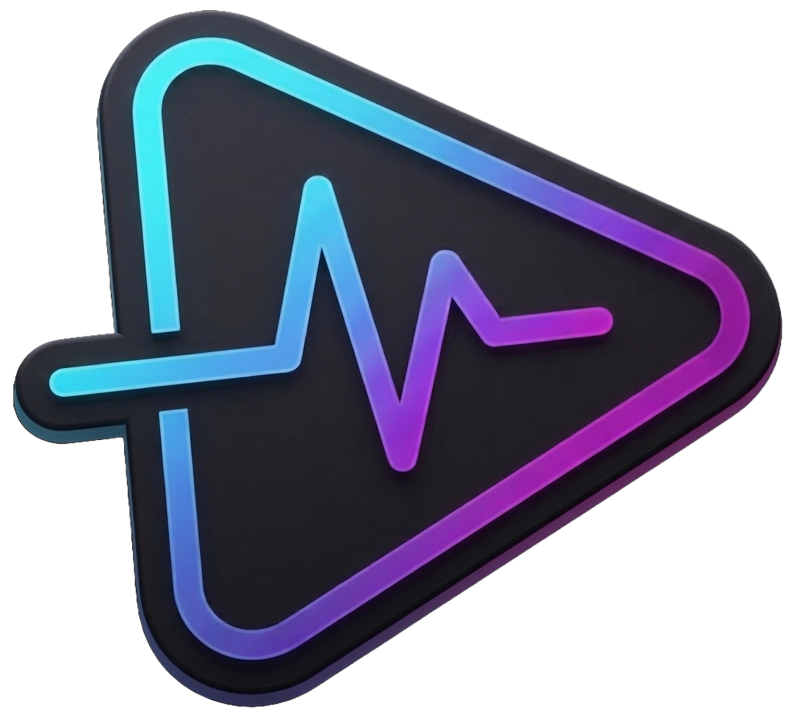

> [!NOTE]
> This project is currently in active development.

<div align="center">

  

  <h1>Pulse Play</h1>
  
  <p>A <b>1st-year academic</b> web project exploring applied data science, algorithmic recommendations, and media routing.</p>

  
  
  
  

</div>

<br />

<!-- TODO: Add project demo GIF here once the UI is fully built.

-->

> [!WARNING]
> **Disclaimer:** This repository contains **PulsePlay**, a personal web development project built strictly for self-learning and skill-building purposes. This platform is not intended for public commercial deployment or copyright infringement.

## Project Overview

PulsePlay is an advanced media discovery portal. The core focus of this project is applying data science and algorithmic concepts to web development.

Instead of dealing with heavy native video hosting, PulsePlay acts as an intelligent routing hub. The application gives users two primary options for any media title—navigating to external watch streams or utilizing external download links—while utilizing backend algorithms to personalize the discovery experience.

## Core Features

- **Dual Action Architecture:** Seamless UI/UX separating external streaming routes and direct external downloading links.
- **Algorithmic Recommendations:** Utilizes user interaction logs (Watch vs. Download routing) and media metadata to drive Content-Based and Collaborative Filtering algorithms.
- **Advanced Text Search:** Powered by MongoDB Text Indexes for typo-tolerant, weighted semantic search across titles, plots, and metadata tags.
- **Custom CMS:** A backend Content Management System for uploading media metadata, extracting tags, and managing the external routing links.

## Tech Stack

- **Frontend:** Next.js (App Router), React, Tailwind CSS
- **Backend:** Next.js API Routes (Node.js)
- **Database:** MongoDB (NoSQL)

## Getting Started

Follow these steps to run the PulsePlay environment locally on your machine.

**1. Clone the repository**

```
git clone https://github.com/Abhisek-Dash-Official/PulsePlay.git
cd pulseplay
```

**2. Install dependencies**

```
npm install
```

**3. Set up environment variables**

Create a `.env.local` file in the root directory and add your connection string:

```
MONGODB_URI=your_mongodb_connection_string_here
```

**4. Run the development server**

```
npm run dev
```

Open http://localhost:3000 with your browser to see the result.

## Roadmap

Here is the planned phased development progression for PulsePlay:

- [x] **Phase 1:** Project Initialization & Architecture
- [ ] **Phase 2:** Database Architecture (MongoDB Connection & Schema Models)
- [ ] **Phase 3:** Admin CMS Development
- [ ] **Phase 4:** User Authentication System
- [ ] **Phase 5:** Global UI & Home Page
- [ ] **Phase 6:** Media Details Hub
- [ ] **Phase 7:** Advanced Text Search Integration (MongoDB)
- [ ] **Phase 8:** User Interactions (Watchlist & Favorites)
- [ ] **Phase 9:** Dynamic Filtering & Sorting Feature
- [ ] **Phase 10:** Algorithmic Recommendation Engine

## Documentation

For a deep dive into the backend architecture, please refer to the project documentation:

- [Database Schema (NoSQL)](./docs/database-schema.md)

- [API Routes & Endpoints](./docs/api-routes.md)
